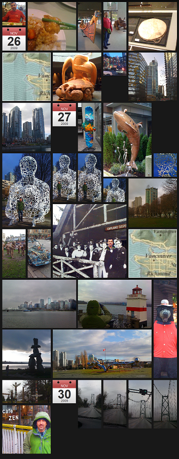

Went to Vancouver for Thanksgiving holiday with Doug. See the iPhoto journal [here](https://www.icloud.com/journal/#p=08&t=CAEQARoQZgR-4rieK12lrZDiAk7e8A==&f=/82J93X7T25~com~apple~mobileiphoto/Public/68E2CFCA-D560-491E-86D7-5F49F6A78F4B.jb/index.json).

Saw lots of First Nation artifacts, mountainous views, public art, went to the Capilano Suspension bridge, kissed a big mounty bear. Fun was had by all.

[here](https://www.icloud.com/journal/#p=08&t=CAEQARoQZgR-4rieK12lrZDiAk7e8A==&f=/82J93X7T25~com~apple~mobileiphoto/Public/68E2CFCA-D560-491E-86D7-5F49F6A78F4B.jb/index.json)
