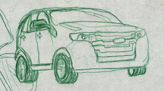

I remember reading [Drawing on the Right Side of the Brain](http://books.google.com/books?id=pmVOmpv2GzoC&lpg=PA1&dq=drawing%20on%20the%20right%20side%20of%20the%20brain&pg=PA1#v=onepage&q&f=false) when I was in Junior High, but I don't really remember how much drawing I did as a result.  But it insired to try a quick drawing, so I picked up the Ford Edge mailer I got today:

So I probably need to work on the perspective a bit, but at least I remember some of the things about "switching to R-mode".  Maybe I should try "switching to R-mode" more often...
