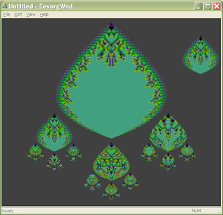

After mucking around for some time, I've managed to dust off my old Eevorg code and incorporate it (with minimal bells and whistles) in to a basic MFC application.  We are rendering with interpolation, to support multiple zoom scales across the child hierarchy.

We also have a simple mechanism to back up (showing the parent to the left of the current eevorg).

Still to be done, is to implement:

  * a persistence mechanism
  * some properties (state count, entropy, maybe lookup table, maybe favorite button)
  * filtering of later generations, to eliminate the aliases in the bottom of some of the eevorg
  * implement as an OpenGL rendering (would take care of filtering using texture mipmaps)

Of course, we would like to implement as a web service so that people can use a browser to browse the eevorg.  And eventually maybe an iPhone/iPad app would be pretty nifty too...
