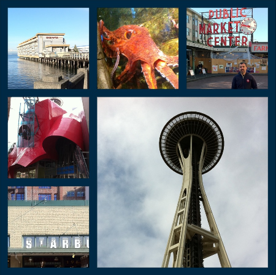

Visited Seattle for the first time -- I like the city.  It has a lot in common with both Vancouver and San Francisco, including slightly cheesy waterfront tourist district.

Went on the Underground Seattle tour (definitely worth doing) as it gave a good history of the city.  Also went up in the Space Needle.  Toured Boeing factory to look at the Dreamliners being assembled.
