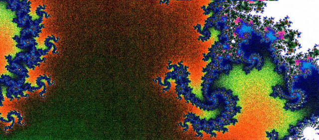

This was a plot made with a speckle noise pattern.  I think the colors were assigned using RGB sinusoidal waves (i.e. the frequency of the R, G, and B waves were varied independently).  Then the actual color was assigned based on a random value.

This was done circa 1991.  I remember there was another plot I had made with purplish colors, that I really liked, but I gave it to someone...

