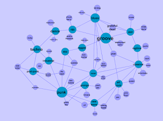

and I transferred part of the SonicSpace (my old test space for [theWheel](http://www.2nd-messenger.com/theWheel.ashx)) in to [cytoscape ](http://www.cytoscape.org/)and used a force-directed layout to get the following (with some manual tweaks):

I also manually changed the size of the nodes, though ideally I would like to implement a cytoscape plugin that would propagate activation changes for me.

Would also like to experiment with cytoscape web, whenever I have the time.
