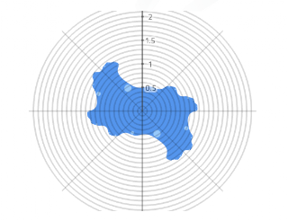

I wrote a JuliaSet animation way back when, that would use a [Lissajou curve](http://en.wikipedia.org/wiki/Lissajous_curve) through the parameter space defining the curves and then draw / erase the resulting fractals.  With color effects, it was quite fun to watch even on a 4.77 MHz PC.

So I was reminded when I saw this very nice WebGL-based animation describing [how Julia Sets are generated](http://acko.net/blog/how-to-fold-a-julia-fractal/).  [Note that you really need to view this site in Chrome or Firefox to get the full effect, as it requires WebGL].  If you've only vaguely understood how the Mandelbrot set is produces, or the relationship between Mandelbrot and Julia sets, then it is worth stepping through the visuals to get a very nice description of the complex math that is used and how the iterations actually produce the fractals.

Plus the animated plot points look a lot like my old JuliaB code, but its too bad you can't interactively change the plot points.
