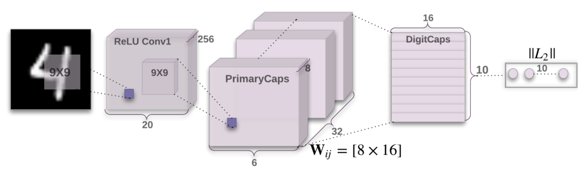

I'm still trying to figure out what to make of the Capsule routing mechanism proposed by Sabour et al late last year. It is potentially a move toward greater biological plausibility, if the claim is that each Capsule corresponds to a cortical column. If the Capsule network does reflect what happens in the visual system, its routing algorithm would need to either develop or learned.

My point of reference here is the Shifter circuit (Olshausen 1993), which never explained how its control weights would have been "learned", despite other biologically plausible characteristics. I've always understood that learning control weights is more difficult than learning filter taps for a convolutional network, or RBM weights. I guess that's why reinforcement learning is so much harder to get right than CNN learning. But I never really thought the Shifter control weights would be learned anyway--I expected they would be the result of developmental processes, just as topographic mappings come from development.

The paper on training the Capsule network doesn't mention consideration of an explicit topographic constraint (like in the Topographic ICA). I wonder how difficult it would be to use a dynamic Self-Organizing Map as a means of organizing the units in the PrimaryCaps layer? Would this simplify the dynamic routing algorithm?
