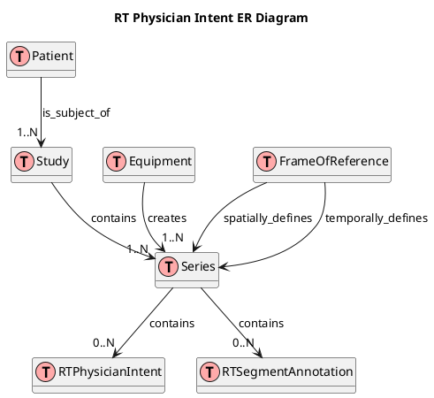
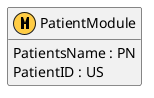
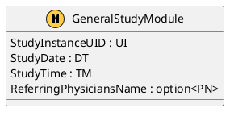
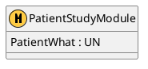
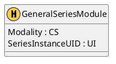
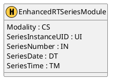
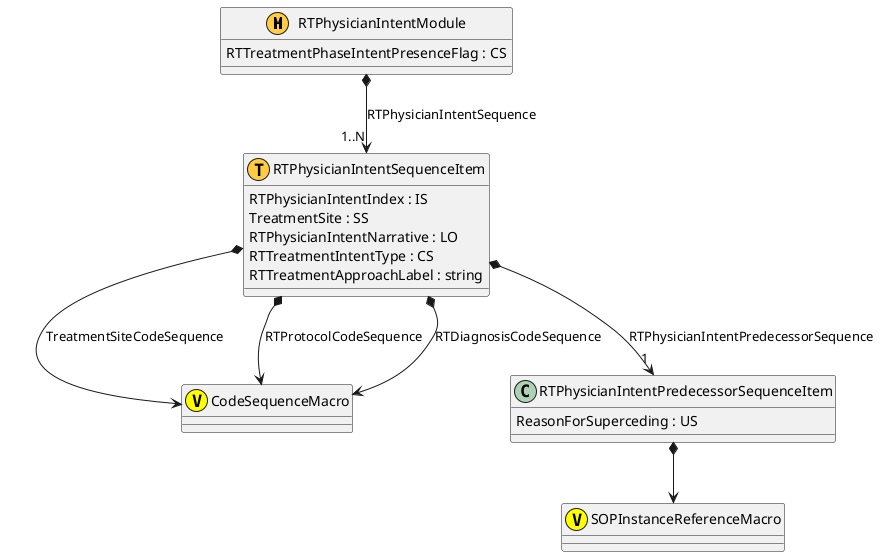
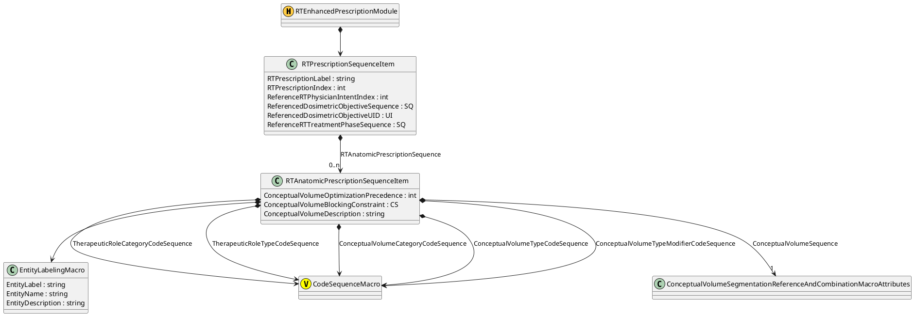
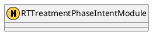

## RTPhysicianIntentERDiagram

|IE      |Module |Reference |Usage
|--------|-------|----------|--------
|Patient |[Patient](#PatientModule) |[C.7.1.1]   |M
|        |Clinical Trial Subject    |[C.7.1.3]   |U
|Study   |[General Study](#GeneralStudyModule)|[C.7.2.1]   |M
|        |[Patient Study](#PatientStudyModule)|[C.7.2.2]   |U
|        |Clinical Trial Study      |[C.7.2.3]   |U
|Series  |General Series            |[C.7.3.1]   |M
|        |Clinical Trial Series     |[C.7.3.2]   |U
|        |Enhanced RT Series        |[C.36.3]    |M
|Equipment|General Equipment        |[C.7.5.1]   |M
|        |Enhanced General Equipment|[C.7.5.2]  |M
|RT Physician Intent|General Reference|[C.12.4] |M
|        |[RT Physician Intent](#RTPhysicianIntentModule)|[C.36.5]   |M
|        |[RT Enhanced Prescription](#RTEnhancedPrescriptionModule)|[C.36.6]   |U
|        |[RT Treatment Phase Intent](#RTTreatmentPhaseIntent)|[C.36.7]   |C - Required if RT Treatment Phase Intent Presence Flag (3010,0045) equals YES.
|        |SOP Common                |[C.12.1]   |M
|        |Common Instance Reference |[C.12.2]   |M
|        |Radiotherapy Common Instance|[C.36.4] |M

## PatientModule

## GeneralStudyModule

## PatientStudyModule

## GeneralSeriesModule

## EnhancedRTSeriesModule

## RTPhysicianIntentModule

## RTEnhancedPrescriptionModule

## RTTreatmentPhaseIntent

[C.7.1.1]: http://dicom.nema.org/medical/dicom/current/output/chtml/part03/sect_C.7.html#sect_C.7.1.1 "Patient Module"
[C.7.1.3]: http://dicom.nema.org/medical/dicom/current/output/chtml/part03/sect_C.7.html#sect_C.7.1.3 "Clinical Trial Subject Module"
[C.7.2.1]: http://dicom.nema.org/medical/dicom/current/output/chtml/part03/sect_C.7.2.html#sect_C.7.2.1 "General Study Module"
[C.7.2.2]: http://dicom.nema.org/medical/dicom/current/output/chtml/part03/sect_C.7.2.html#sect_C.7.2.2 "Patient Study Module"
[C.7.2.3]: http://dicom.nema.org/medical/dicom/current/output/chtml/part03/sect_C.7.2.html#sect_C.7.2.3 "General Study Module"
[C.7.3.1]: http://dicom.nema.org/medical/dicom/current/output/chtml/part03/sect_C.7.3.html#sect_C.7.3.1 "General Series Module"
[C.7.3.2]: http://dicom.nema.org/medical/dicom/current/output/chtml/part03/sect_C.7.3.html#sect_C.7.3.2 "Clinical Trial Series Module"
[C.36.3]: http://dicom.nema.org/medical/dicom/current/output/chtml/part03/sect_C.36.3.html#sect_C.36.3 "Enhanced RT Series Module"
[C.36.5]: http://dicom.nema.org/medical/dicom/current/output/chtml/part03/sect_C.36.5.html#sect_C.36.5 "Enhanced RT Series Module"
[C.36.6]: http://dicom.nema.org/medical/dicom/current/output/chtml/part03/sect_C.36.6.html#sect_C.36.6 "Enhanced RT Series Module"
[C.36.7]: http://dicom.nema.org/medical/dicom/current/output/chtml/part03/sect_C.36.7.html#sect_C.36.7 "Enhanced RT Series Module"